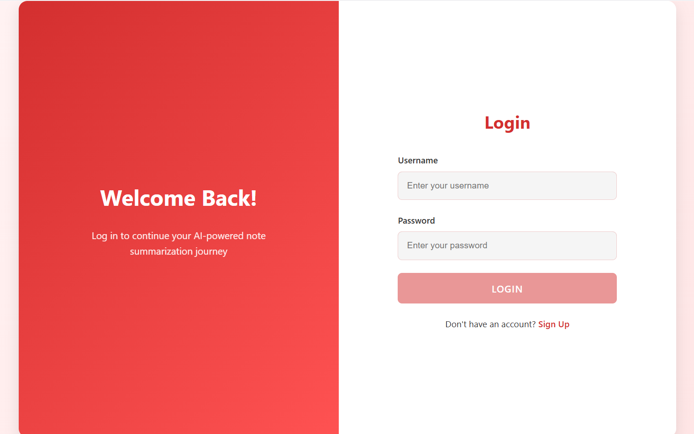
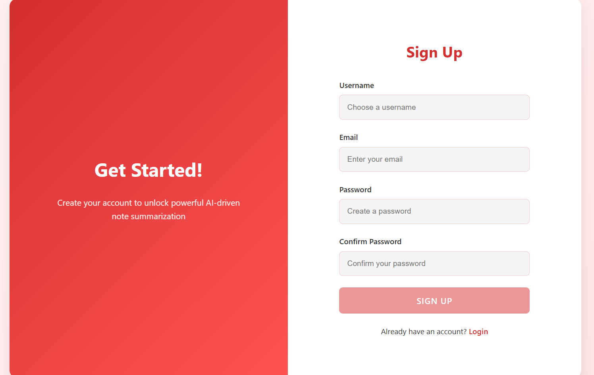
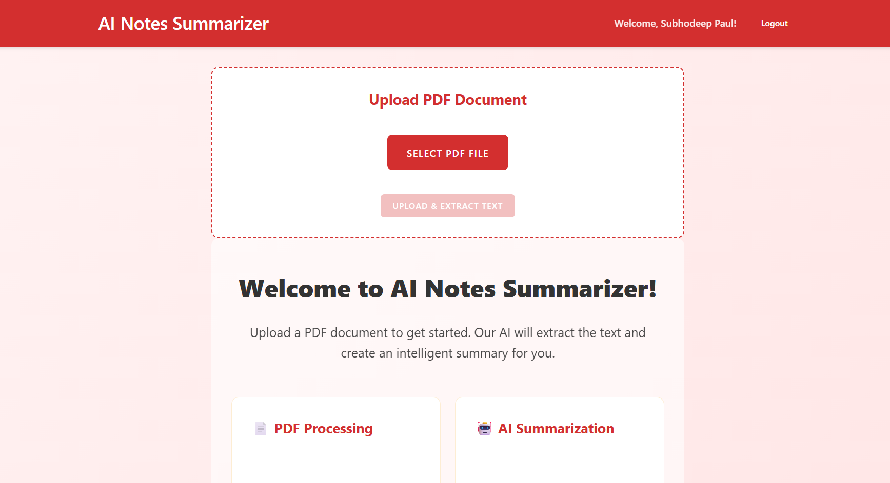
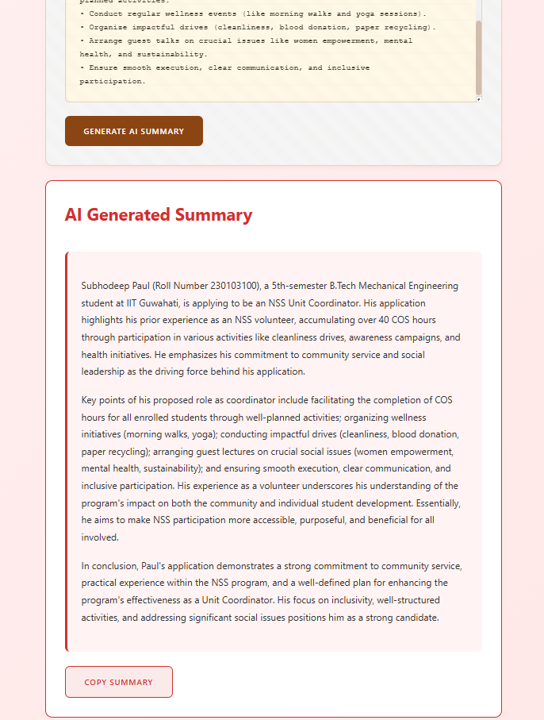

# 📘 AI Notes Summarizer

## 👤 Author
- **Name**: Subhodeep Paul  
- **University**: Indian Institute of Technology Guwahati (IITG)  
- **Department**: Mechanical Engineering  

---

## 🚀 Project Overview
**AI Notes Summarizer** is a web application that helps students quickly summarize their lecture slides or notes.  
It allows users to:
- Create an account (Signup/Login)
- Upload lecture slides or notes in **PDF format**
- Extract raw text from PDFs
- Generate **concise summaries** using Google Gemini AI  

This tool is designed to save time during exam preparation by automatically condensing key topics, formulas, and takeaways.  

---

## 📋 Features
- 🔐 **User Authentication** (Signup/Login with JWT)  
- 📂 **PDF Upload & Text Extraction**  
- 🤖 **AI-powered Text Summarization** (Gemini API)  
- 🎨 **Simple and Intuitive UI**  

---

## 📸 Screenshots

### 🔹 Login Page


### 🔹 Signup Page


### 🔹 Dashboard (PDF Upload)


### 🔹 Summary Output


---

## 🎥 Demo Video (Optional)
👉 You can upload a short walkthrough video (2–3 mins) to YouTube or Google Drive and paste the link here.  

**Demo Video Link:** [Upload your demo video here]  

---

## 🛠️ Technologies Used
- **Frontend**: React (deployed on Vercel)  
- **Backend**: Node.js + Express (deployed on Railway)  
- **Database**: MongoDB Atlas (cloud-hosted)  
- **AI Integration**: Google Gemini API  
- **Authentication**: JWT-based login system  
- **File Handling**: Multer (for PDF uploads)  

---

## ⚙️ Setup Instructions

### 🔹 Backend Setup
```bash
cd backend
npm install
npm start


# 📘 AI Notes Summarizer

## 🚀 Project Overview
An AI-powered notes summarization application that helps students quickly revise important concepts from their study materials.

### Key Features
- 👤 User Authentication (Signup/Login)
- 📄 PDF Upload & Text Extraction
- 🤖 AI-Powered Summarization
- 💾 Secure Data Storage

## 🛠️ Technologies Used
- **Frontend:** React (Vercel)
- **Backend:** Node.js + Express (Railway)
- **Database:** MongoDB Atlas
- **AI:** Google Gemini API
- **Authentication:** JWT
- **File Handling:** Multer

## ⚙️ Prerequisites
- Node.js v16 or later
- npm (included with Node.js)
- MongoDB Atlas account
- Gemini API Key

## 📦 Setup Instructions

### Backend Setup
```bash
cd backend
npm install
npm start
```
Server runs at: http://localhost:5000

### Frontend Setup
```bash
cd frontend
npm install
npm start
```
React app runs at: http://localhost:3000

### Environment Configuration
1. Create `.env` in backend directory:
```env
MONGODB_URI=your_mongodb_uri
JWT_SECRET=your_jwt_secret
GEMINI_API_KEY=your_gemini_api_key
PORT=5000
```

2. Create `.env` in frontend directory:
```env
REACT_APP_API_URL=http://localhost:5000/api
```

## 🏗️ System Architecture

### Data Models

#### User Schema
```javascript
{
  username: String,
  email: String,
  password: String, // hashed
  createdAt: Date
}
```

### Component Structure
- 🔐 Authentication
  - Login
  - Signup
- 📊 Dashboard
  - PDF Upload
  - Summary Display
- 🔄 API Integration
  - PDF Processing
  - Gemini AI Summarization

## 🔐 Security Features
- Password hashing with bcrypt
- JWT-based authentication
- Environment variables for secrets
- Secure file upload handling
- Temporary PDF storage

## 📝 API Documentation

### Authentication Endpoints
- POST `/api/signup` - Create new user
- POST `/api/login` - User login
- GET `/api/user-profile` - Get user profile

### PDF Processing
- POST `/api/upload-pdf` - Upload PDF
- POST `/api/summarize` - Generate summary

## 🚀 Deployment
- Frontend: Vercel
- Backend: Railway
- Database: MongoDB Atlas

## 📸 Demo
[Add screenshots or demo video link here]

## 🔄 Development Workflow
1. Clone repository
2. Set up environment variables
3. Install dependencies
4. Start development servers

## 📋 TODO
- [ ] Advanced error handling
- [ ] Enhanced PDF text extraction
- [ ] Improved summarization accuracy
- [ ] User preferences storage

## 👥 Contributing
1. Fork the repository
2. Create feature branch
3. Commit changes
4. Push to branch
5. Open pull request
